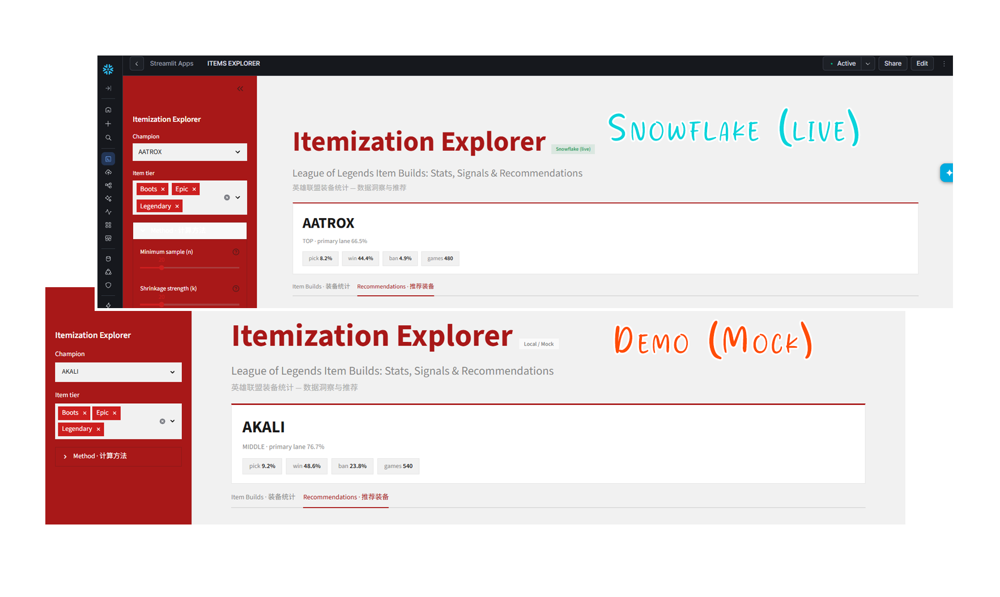
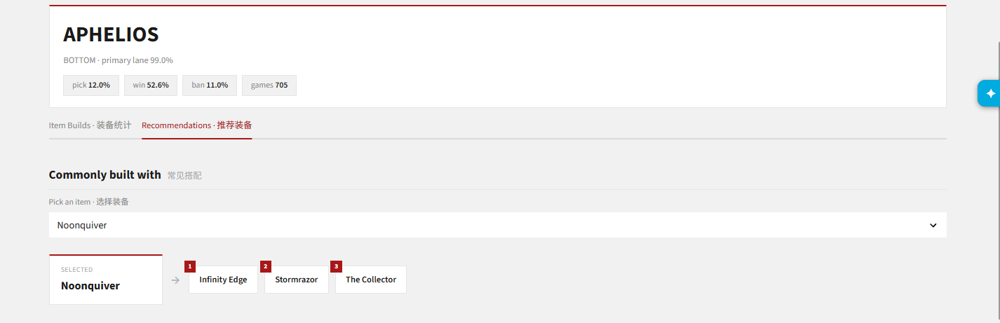
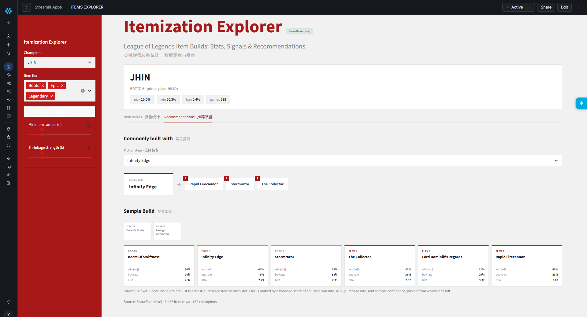
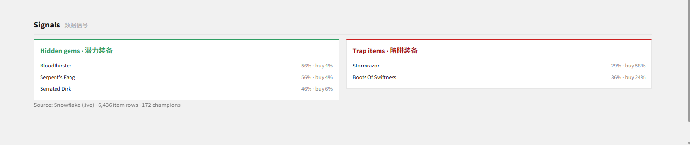

# Itemization Explorer

### Play with the live demo here: [league-sf-item-browser.streamlit.app](https://league-sf-item-browser.streamlit.app/)

### Or visit the parent pipeline: [github.com/TotoriYoyori/league-snowflake](https://github.com/TotoriYoyori/league-snowflake)

----
* **Browse full item build stats for any champion:** purchase rate, raw win rate, KDA, first-purchase
  timing.
* **Find hidden gems and trap items:** adjusted with empirical Bayes shrinkage.
* **Find item recommendations:** per item, per champion. Informed by live, tangible data, instead of being told so
by a stat aggregator site.

> *Snowflake version is deployed as a warehouse-runtime app, capable of using live, continuous data from the pipeline. Demo versions uses a small subset of sample data, hosted on Streamlit Cloud.*



----
## Project structure

```
LeagueSnowflakeItemBrowser/
├── streamlit_app.py      # entry point
├── settings.py           # validated config
├── src/
│   ├── query.py          # live Snowflake query
│   ├── data.py           # all data procurement for ui display, and caching
│   ├── mock.py           # local CSV loaders, mirrors query.py's join
│   ├── stats.py          # pure shrinkage / gem-trap / BIS scoring functions
│   └── ui/               # renders: theme (palette + CSS) and components (shared chrome)
├── assets/
│   └── sample_data/      # placeholder champion/item CSVs, used whenever running locally
```

----
## Gallery



> *What should I buy after Noonquiver on Aphelios? (Item Recommendations tab)*



> *What does the current data suggest for me to buy on Jhin? (Item Recommendations tab)*



> *What are some items that win a lot but no one buys (hidden gems)? What items do a lot of people
buy but doens't perform as well as expected (traps)?*

Method, in short:

* **Shrinkage:** each item's win rate is pulled toward its champion' baseline win rate by `k` games'
  worth of "benefit of the doubt." High-n items barely move; low-n items collapse toward what's
  typical for that champion.
* **Gem / trap flags:** only assigned to items clearing a minimum sample floor, so a flag is never just noise from
  one unlucky (or lucky) game (e.g. at least 10 games to be considered a gem)

> *Both `k` (shrinkage strength) and the minimum sample floor are available as sidebar controls.*

----
## Known limitations
- No persisted history: every session recomputes fresh off the same static gold tables. "Patch over
  patch" tracking today means re-running this app on each patch's data and comparing manually (future updates maybe...)

> Original source: [LoL Match Intervals: 2 Million In-Game Snapshots](https://www.kaggle.com/datasets/nathansmallcalder/league-of-legends-match-interval-snapshots-2026)

----
**Stacks used:** Python | SQL | NumPy | Pandas | Pydantic | Streamlit | Snowflake